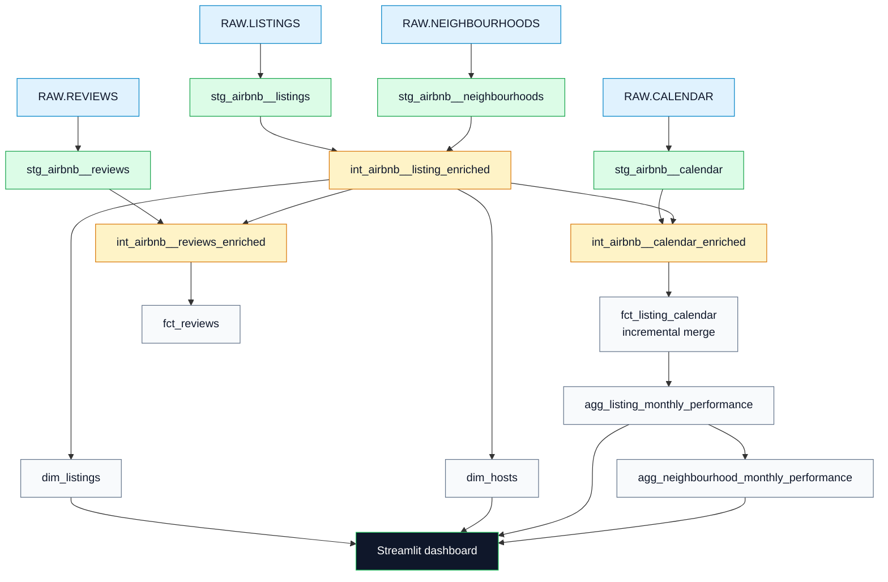

# Airbnb Snowflake dbt Analytics Project

Public analytics engineering portfolio project that loads the Inside Airbnb open dataset into Snowflake, transforms it with dbt, validates data quality, and powers a Streamlit reporting dashboard.

## What This Project Demonstrates

- Snowflake raw-zone setup for open data ingestion
- Local CSV/GZIP loading into Snowflake internal stages
- dbt staging, intermediate, and mart model layers
- Incremental fact modeling with Snowflake merge strategy
- dbt generic tests and singular tests for data quality
- Model documentation with persisted docs support
- Streamlit dashboard connected to analytics marts
- Public-safe configuration with ignored local credential files

## Dataset

Source: [Inside Airbnb](https://insideairbnb.com/get-the-data/)

Recommended classroom dataset: New York City, New York, United States.

Expected raw files:

```text
data/raw/listings.csv.gz
data/raw/calendar.csv.gz
data/raw/reviews.csv.gz
data/raw/neighbourhoods.csv
```

Inside Airbnb does not provide booking transactions. This project uses calendar availability and price data as a classroom-friendly proxy for unavailable-night revenue.

## Architecture

```mermaid
flowchart LR
    A["Inside Airbnb files<br/>listings, calendar, reviews, neighbourhoods"] --> B["Python loader<br/>load_inside_airbnb_to_snowflake.py"]
    B --> C["Snowflake internal stage<br/>INSIDE_AIRBNB_STAGE"]
    C --> D["RAW schema<br/>text-preserving raw tables"]
    D --> E["dbt staging views<br/>clean + cast + standardize"]
    E --> F["dbt intermediate layer<br/>joins + enrichment + revenue proxy"]
    F --> G["dbt marts<br/>dimensions, facts, monthly aggregates"]
    G --> H["Streamlit dashboard<br/>neighbourhood, host, listing analytics"]

    I["profiles.yml<br/>ignored local Snowflake config"] -.-> J["dbt CLI"]
    J --> E
    J --> F
    J --> G

    style A fill:#E0F2FE,stroke:#0284C7,color:#0F172A
    style B fill:#F8FAFC,stroke:#64748B,color:#0F172A
    style C fill:#FEF3C7,stroke:#D97706,color:#0F172A
    style D fill:#FEF3C7,stroke:#D97706,color:#0F172A
    style E fill:#DCFCE7,stroke:#16A34A,color:#0F172A
    style F fill:#DCFCE7,stroke:#16A34A,color:#0F172A
    style G fill:#DCFCE7,stroke:#16A34A,color:#0F172A
    style H fill:#0F172A,stroke:#22C55E,color:#FFFFFF
```



## dbt Lineage



## dbt Model Layers

| Layer | Models | Purpose |
| --- | --- | --- |
| Sources | `RAW.LISTINGS`, `RAW.CALENDAR`, `RAW.REVIEWS`, `RAW.NEIGHBOURHOODS` | Raw files loaded into Snowflake |
| Staging | `stg_airbnb__*` | Cleaning, type casting, standard column names |
| Intermediate | `int_airbnb__*` | Reusable joins, enrichment, revenue proxy logic |
| Marts | `dim_listings`, `dim_hosts`, `fct_listing_calendar`, `fct_reviews` | Analytics-ready dimensions and facts |
| Aggregates | `agg_listing_monthly_performance`, `agg_neighbourhood_monthly_performance` | Reporting-ready monthly metrics |

## Repository Structure

```text
.
├── analyses/
├── dashboard/
│   └── streamlit_app.py
├── data/raw/
├── dbt_project.yml
├── profiles.yml.example
├── config/
│   └── local_credentials.example.json
├── docs/
├── macros/
├── models/
│   ├── staging/
│   ├── intermediate/
│   └── marts/
├── scripts/
│   └── load_inside_airbnb_to_snowflake.py
├── setup/
│   └── snowflake_setup.sql
├── tests/
└── requirements.txt
```

## Public-Safe Credential Setup

This public repository does not commit real credentials and does not require environment variables.

Create local-only files from the examples:

```bash
cp profiles.yml.example profiles.yml
cp config/local_credentials.example.json config/local_credentials.json
```

Then edit both local files with your Snowflake values. These files are ignored by git:

- `profiles.yml`
- `config/local_credentials.json`
- `.user.yml`

## Install

```bash
python3 -m venv .venv
source .venv/bin/activate
pip install -r requirements.txt
```

## Load Raw Data

```bash
python scripts/load_inside_airbnb_to_snowflake.py
```

The loader creates Snowflake objects from `setup/snowflake_setup.sql`, uploads the local raw files to a Snowflake internal stage, recreates raw tables from CSV headers, and copies data into the `RAW` schema.

## Run dbt

```bash
dbt debug --profiles-dir .
dbt run --profiles-dir .
dbt test --profiles-dir .
dbt docs generate --profiles-dir .
```

For a new Inside Airbnb snapshot:

```bash
python scripts/load_inside_airbnb_to_snowflake.py
dbt run --full-refresh --select fct_listing_calendar+ --profiles-dir .
dbt test --profiles-dir .
```

## Run the Dashboard

```bash
streamlit run dashboard/streamlit_app.py
```

The dashboard reads local Snowflake values from `config/local_credentials.json`.

## Example Business Questions

- Which neighbourhoods have the highest estimated unavailable-night revenue?
- Which room types have the highest average daily price?
- Which hosts manage the most listings?
- Which neighbourhoods have the lowest availability rate?
- How does listing availability vary by month?

## Data Quality

The project includes tests for:

- Source primary identifiers
- Listing and review uniqueness
- Required listing/calendar/review fields
- Room type accepted values
- Calendar-to-listing relationships
- Non-negative prices
- Duplicate listing-date checks

## Security Notes

Do not commit:

- Snowflake usernames or passwords
- `profiles.yml`
- `config/local_credentials.json`
- dbt `target/`
- dbt `logs/`
- Python virtual environments

The committed files contain placeholders only.

## Owner

Built by [Durgesh Yadav](https://github.com/analyticsdurgesh) as a Snowflake, dbt, and analytics engineering portfolio project.
